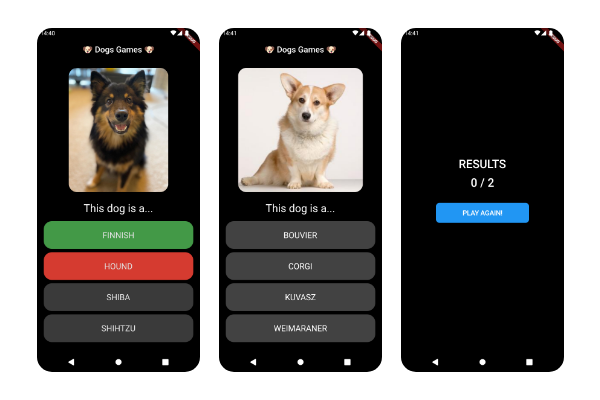
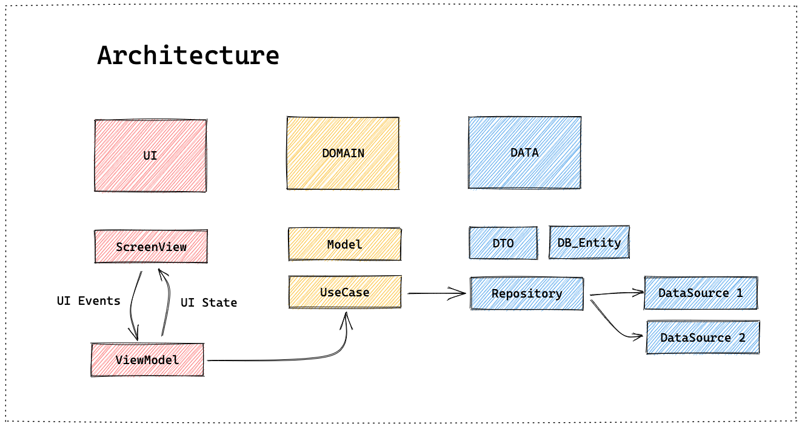

# DOGS GAMES

# Flutter Clean Architecture Example by [myanes](https://github.com/myanes-dev)
Sample app with implementation of every layer of my approach to Clean Architecture for **Flutter**:


## Presentation <-> Domain <-> Data
- Presentation: Screens/Views + ViewModels
- Domain: Models + UseCases
- Data: DTOs + DB_Entities +Repositories + DataSources

## Tech Specifications
- DI
- MVVM: UI State and Events
- Use cases
- Repository pattern
- Networking: Http + Json decode
- Offline mode: Local database
- Simple custom Router
- Theme: Light & Dark (from system settings)
- Basic Error Handling
- Testing: Widgets + Unit tests

## Libraries 📦
- Dendency Injection with [get_it](https://pub.dev/packages/get_it)
- State Management with [getX](https://pub.dev/packages/get) & [bloc(cubit)](https://pub.dev/packages/flutter_bloc)
- Tesiting with [mockito](https://pub.dev/packages/mockito)
- Networking with [http](https://pub.dev/packages/http)
- Local database with [hive](https://pub.dev/packages/hive)


> **Comming soon**:
> - Translated Strings -> i18n
> - More robust error handling
> - More complex state management examples with [bloc](https://pub.dev/packages/flutter_bloc)
> - Custom App Icon + Splash screen

## App Features 📋

- **Play Screen**. Two rouds where you can guess the breed of a random dog by looking at it's picture.
Data comes from Dog CEO: https://dog.ceo/dog-api/
- **Results Scren**. It shows correct answers count and a replay button.
- **Results history** saved in local database


## Testing ⚙️

Both **Unit and Widget tests** examples are available. For Unit testing dependencies are replaced by mock classes generated by [mockito](https://pub.dev/packages/mockito).

### Verifications:
- A game is created with 2 rounds
- Loading indicator it's shown and hided
- Move to next round
- Show game results
 
Some examples:

```
- PlayViewModel - Unit testing
- GameCreatorUsecase - Unit testing
- GameResultScreen - Widget testing
```


## License 📄

Feel free to use it ❤️.

A ⭐️ is appreciated

---
with 🧠 by [myanes](https://github.com/myanes-dev) 😜

